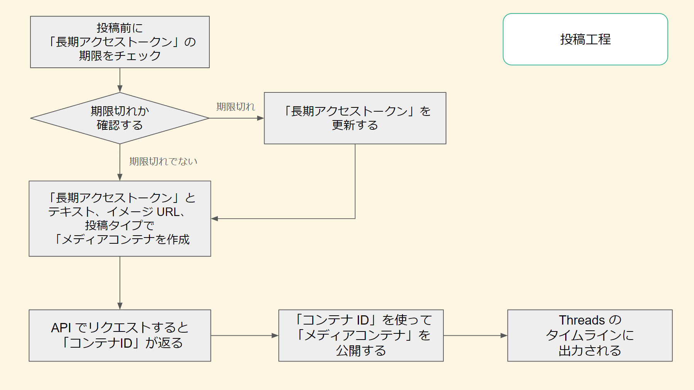

# Thread API by PHP

## 概要

* これは PHP で「Threads API」を扱うためのクラスとサンプルファイルです

---

## 謝辞

* [taoka3/threads-api](https://github.com/taoka3/threads-api) を参考にいたしました。御礼申し上げます。

---

### 元クラスとの違い

* 改修、追加した機能は以下の通りです

---

* cURL を使った HTTP リクエストから、ストリームを使ったリクエストに変更
  * 一部サーバは cURL が使えないため、汎用性を持たせるために変更
* 「長期アクセストークン」を保存するためのサンプルデータベース（SQLite）の実装
* アクセストークンの有効期限を分かりやすいフォーマットに変換
  * API が返却するのは実行時から有効期限までの「秒数」のため
* 定数ファイルの追加
* データベースの情報を確認する簡易ビューワ

---

## ファイル一覧と使い方

### ファイル一覧

* ThreadsClass.php … Thread API を扱うクラス
* const.php .........  定数ファイル（管理画面で取得した ID、リダイレクト URL 等）
* authorize.php … 「承認ウィンドゥ」をリクエストし、リダイレクトで開く
* redirectCallback.php … リダイレクトでコールバックを取得し、トークンを保存する
* post.php … 投稿するファイル
* token_viewer.php … 現在のデータベースに保存されている情報を簡易的に確認する

---

### 使い方

* const.php に管理画面で取得した ID、リダイレクト URL 等を設定
* authorize.php を実行し、承認ウィンドゥを開き、承認ボタンを押す
* リダイレクトでコールバックを取得し、トークンが保存されます
* post.php を実行し、投稿を行います

---

## データベース構造

* コンストラクタで作成されます

* サンプルデータベース: SQLite「threads_tokens.sqlite」
* テーブル名: 「threads」

### テーブル構造

# データベース構造

|カラム名|型|初期値|
|---|---|---|
|id|INTEGER|not null|
|expires_in|TEXT|0|
|limit_date|TEXT|0|
|long_access_token|text|not null|

* API はトークンを返した時点から期限切れまでの秒数（expires_in）を返却します
* そのため、現時点から期限切れまでの秒数を加算して扱いやすい「'Y-m-d H:i:s'」のフォーマットに変換した上で保存しています

---

## フローチャート

* 他の SNS を比較すると複雑な工程のため、フローチャートを作成しました

### 承認

* 短期アクセストークン
  * 発行から1時間有効
* 長期アクセストークン
  * 発行から60日有効
  * 更新用 API で60日延長可能
    * **本設計では7日前から更新を行うように設定**

---

### 投稿

---

## Meta for Developers での設定

### アプリの作成

* [Meta for Developers: アプリ](https://developers.facebook.com/apps/) を開く
* 画面右上の「マイアプリ」をクリック
* 「アプリを作成」ボタンを押す
* 新規に名前を付けてアプリを作成する
* 「現時点ではビジネスポートフォリオをリンクしない。」を選択し、「次へ」をクリック
* 「Threads API にアクセス」を選択し、「次へ」をクリック
* 「アプリ名を追加」と「アプリの連絡先メールアドレス」を入力し、
「次へ」をクリック
* 利用規約と開発者ポリシーを確認
* 「アプリを作成」をクリック
* 本人確認のためユーザーパスワードを入力するダイアログが表示されるので、入力して次へ進む
* 十数秒ほど待ち、問題がなければ「アプリが作成されました」のダイアログが表示される

---

### IDの取得とリダイレクトURLの設定

* メニュー「ユースケース」をクリック
* 作成した Threads アプリの「カスタマイズ」をクリック
* 「アクセス許可」より、「**threads_basic**」と「**threads_content_publish**」の「追加」ボタンを押して有効化
  - **この2つが「投稿」に必要な最低限の権限です**
* 続けて「設定」より「コールバック URL をリダイレクト」の入力欄に、にサイトに設置した**コールバック URL** を登録します
  - **公開されているサーバが必要かつ、コールバック URL としての画面を用意する必要があります（このため、投稿用プログラム単体では実装できません）**
  - 「承認コード」は localhost でも取得できますが、**アクセストークンは正式なドメインサーバでないと取得できません**
* 「アプリの設定」> 「ベーシック」をクリックして「アプリドメイン」を登録
* 「**ThreadsアプリID**」と「**Threads App Secret**」をコピーし、本プロジェクトでは、const.php に設定（**API 利用に必須**）
* 「表示名」「ウェブサイト」(URL)も入力（他の項目もなるべく入力する）
* 「アプリの設定」> 「詳細設定」では「ドメインマネージャ」で利用するサイトのドメインを入力

---

### テスターの登録
* メニュー「ユースケース」をクリックし、作成した Threads アプリの「カスタマイズ」をクリック
* 「設定」の下にある「ユーザートークン生成ツール」の「threads テスターを追加または削除」をクリック
* 「アプリの役割」画面へ遷移するので、「メンバーを追加」をクリック
* 「追加したいThreadsカウントのユーザーネームを入力してください」に API を利用して投稿するアカウント名を入力し、役割「Threadsテスター」を選択して「追加」ボタンを押す
* 追加したあと、「ウェブサイトのアクセス許可」をクリックすると設定したアカウントの Threads 画面が開く
* 「ウェブサイトのアクセス許可」をクリックし「アクティブ」タブより認証を行う

---

## 参考サイト

* [Threads API](https://developers.facebook.com/docs/threads): 公式ドキュメント
* [Meta for Developers](https://developers.facebook.com/apps/): 開発者向けのページ

---

## ライセンス

* MIT ライセンス

---

