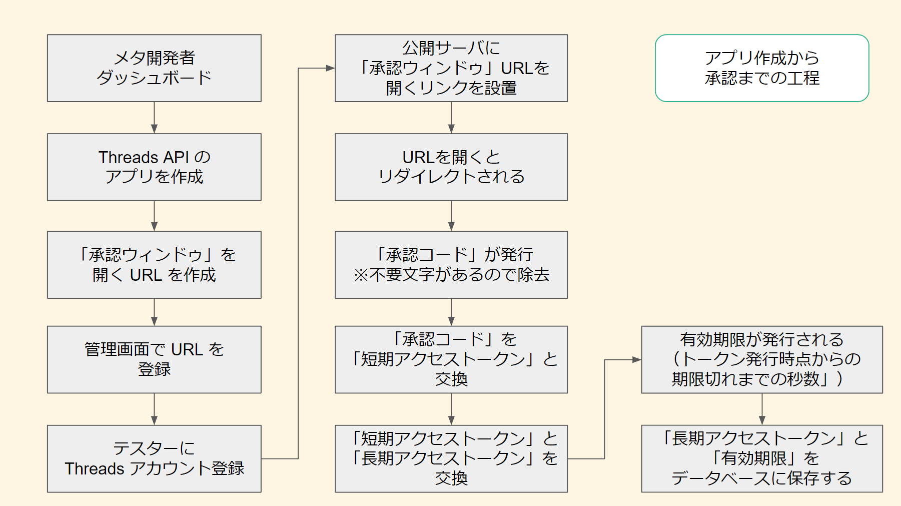

# Thread API by PHP

## 概要

* PHP で「Threads API」を扱うための API です

---

## 謝辞

* [taoka3/threads-api](https://github.com/taoka3/threads-api) を参考にいたしました

---

### 元クラスとの違い

* 改修、追加した機能は以下の通りです

---

* cURL を使った HTTP リクエストから、ストリームを使ったリクエストに変更
  * 一部サーバは cURL が使えないため、汎用性を持たせるために変更
* 「長期アクセストークン」を保存するためのサンプルデータベース（SQLite）の実装
* アクセストークンの有効期限を分かりやすいフォーマットに変換
  * API が返却するのは実行時から有効期限までの「秒数」のため
* 定数ファイルの追加
* データベースの情報を確認する簡易ビューワ

---

## ファイル一覧と使い方

### ファイル一覧

* ThreadsClass.php … Thread API を扱うクラス
* const.php .........  定数ファイル（管理画面で取得した ID、リダイレクト URL 等）
* authorize.php … 「承認ウィンドゥ」をリクエストし、リダイレクトで開く
* redirectCallback.php … リダイレクトでコールバックを取得し、トークンを保存する
* post.php … 投稿するファイル
* token_viewer.php … 現在のデータベースに保存されている情報を簡易的に確認する

---

### 使い方

* const.php に管理画面で取得した ID、リダイレクト URL 等を設定
* authorize.php を実行し、承認ウィンドゥを開き、承認ボタンを押す
* リダイレクトでコールバックを取得し、トークンが保存されます
* post.php を実行し、投稿を行います

---

## データベース構造

* コンストラクタで作成されます

* サンプルデータベース: SQLite「threads_tokens.sqlite」
* テーブル名: 「threads」

### テーブル構造

# データベース構造

|カラム名|型|初期値|
|---|---|---|
|id|INTEGER|not null|
|expires_in|TEXT|0|
|limit_date|TEXT|0|
|long_access_token|text|not null|

* API はトークンを返した時点から期限切れまでの秒数（expires_in）を返却します
* そのため、現時点から期限切れまでの秒数を加算して扱いやすい「'Y-m-d H:i:s'」のフォーマットに変換した上で保存しています

---

## フローチャート

* 他の SNS を比較すると複雑な工程のため、フローチャートを作成しました

### 承認

---

### 投稿

---

## 参考サイト

* [Threads API](https://developers.facebook.com/docs/threads): 公式ドキュメント
* [Meta for Developers](https://developers.facebook.com/apps/): 開発者向けのページ

---

## ライセンス

* MIT ライセンス

---

